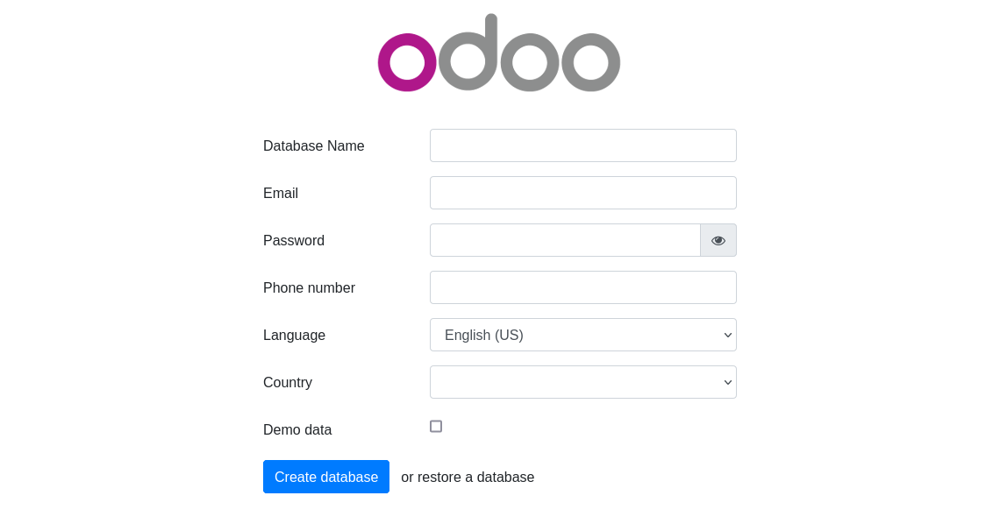

# Instalando Odoo con docker


Una solución flexible y rápida para implementar multiples instancias de `Odoo` en un servidor. Algunas razónes por las que usted podría usar esta guía.
- Versiones soportados de [**Odoo**][odoo] (`12`, `12.0`, `13`, `13.0`, `14`, `14.0`, `latest`).
- Versiones soportados de [**PostgreSQL**][postgres](`10`, `11`, `12`, `13`, `alpine`, `latest`).
- Configuración optimizada para entorno de desarrollo y producción.


## Requerimientos
- [Docker][docker]
- [Docker Compose][docker-compose]


# Cómo implementar
## Iniciar una instancia
**1.** Instale docker y docker-compose en su servidor. (Omita este paso si tiene docker instalado).

**Ubuntu**
```bash
curl -s https://raw.githubusercontent.com/FredyChivalan/odoo-docker-compose/main/resources/install_docker/install_docker_on_ubuntu.sh | bash
```
**Debian**
```bash
curl -s https://raw.githubusercontent.com/FredyChivalan/odoo-docker-compose/main/resources/install_docker/install_docker_on_debian.sh | bash
```


**2.** Supongamos que desea crear un proyecto de `odoo` llamado "**simple-odoo**".
```bash
curl -s https://raw.githubusercontent.com/FredyChivalan/odoo-docker-compose/main/run.sh | bash -s simple-odoo 14.0 8070
```
Al final de la línea de comando, encontrará argumentos predeterminados:
  - Primer argumento (**simple-odoo**): nombre del proyecto.
  - Segundo argumento (**14.0**): Versión de Odoo.
  - Tercer argumento (**8070**): Puerto a exponer.


**3.** Espere a que se inicialice completamente, y visita `http://localhost:8070` o `http://host-ip:8070` (según corresponda).



## Detener y reiniciar una instancia de Odoo
Ejecute estas instrucciones en un proyecto de **Odoo**.

**Iniciar**
```bash
docker-compose up -d
```
**Reiniciar**
```bash
docker-compose restart
```
**Detener**
```bash
docker-compose down
```

## Ejecutar varias instancias de Odoo

**Restaurante**
```bash
curl -s https://raw.githubusercontent.com/FredyChivalan/odoo-docker-compose/main/run.sh | bash -s restaurante 12.0 8071
```
**Cafetería**
```bash
curl -s https://raw.githubusercontent.com/FredyChivalan/odoo-docker-compose/main/run.sh | bash -s cafeteria 13.0 8072
```
Tenga en cuenta exponer nombres y puertos diferentes para cada proyecto (por ejemplo, restaurante expone el puerto 8071 y cafeteria expone el puerto 8072).


# Cómo extender esta guía
Esta guía está inspirada para sistema operativo GNU/Linux.
Sin tratar de apoyar a cada posible caso de uso, aquí son sólo algunas que hemos encontrado útiles.

## Las variables de entorno
Ajustar estas variables de entorno para conectar fácilmente a un servidor postgres con su proyecto [`Odoo`][odoo]. Alojados en un archivo `.env`

`PROJECT_NAME`: Esta opcional variable de entorno se utiliza para definir un nombre diferente para los proyectos de `Odoo`. No debe estar vacío.


`ODOO_VERSION`: Esta variables de entorno es necesaria para utilizar [`Odoo`][odoo]. No debe estar vacio. En esta variable de entorno se establece la version soportado y mantenida por [**Odoo**][odoo] (`12`, `12.0`, `13`, `13.0`, `14`, `14.0`, `latest`).

`PORT`: Esta opcional variable de entorno es necesaria para utilizar [`Odoo`][odoo]. No debe estár vacio. Se implementa para exponer el puerto que escuchará el contenedor del proyecto **Odoo**.

`POSTGRES_VERSION`: Esta variables de entorno es necesaria para utilizar PostgreSQL. No debe estar vacio. En esta variable de entorno se establece la version soportado y mantenida por [Postgres][postgres].([Consulte aquí][postgres]), Por defecto utiliza la version `alpine`.

`POSTGRES_USER`: Este opcional variable de entorno se utiliza en conjunción con `POSTGRES_PASSWORD` configurar un usuario y su contraseña. Esta variable va a crear el usuario especificado con permisos de superusuario y una base de datos con el mismo nombre. Si no se especifica, el valor predeterminado de usuario de `postgres` va a ser utilizado.

`POSTGRES_DB`: Este opcional variable de entorno se pueden utilizar para definir un nombre diferente para la base de datos por defecto que se crea cuando la imagen se inicia por primera vez. Si no es especificado, entonces el valor de `POSTGRES_USER` va a ser utilizado.

`POSTGRES_PASSWORD`: Esta variable de entorno es necesaria para utilizar PostgreSQL. No debe estar vacío o indefinido. Esta variable de entorno se establece la contraseña de superusuario para PostgreSQL. El valor predeterminado de superusuario se define por la `POSTGRES_USER` la variable de entorno.


## Dónde se almacenan los Datos

**Nota importante:** Hay varias maneras de guardar los datos usados por las aplicaciones que se ejecutan en contenedores docker. Animamos a los usuarios de las imágenes postgres para familiarizarse con las [`opciones disponibles`][volumes].


[docker]: https://docs.docker.com/engine/install/ "Docker"
[docker-compose]: https://docs.docker.com/compose/install/ "Docker Compose"
[odoo]: https://hub.docker.com/_/odoo/ "Odoo"
[postgres]: https://hub.docker.com/_/postgres/ "Postgres"
[volumes]: https://docs.docker.com/storage/volumes/ "Volumes"
