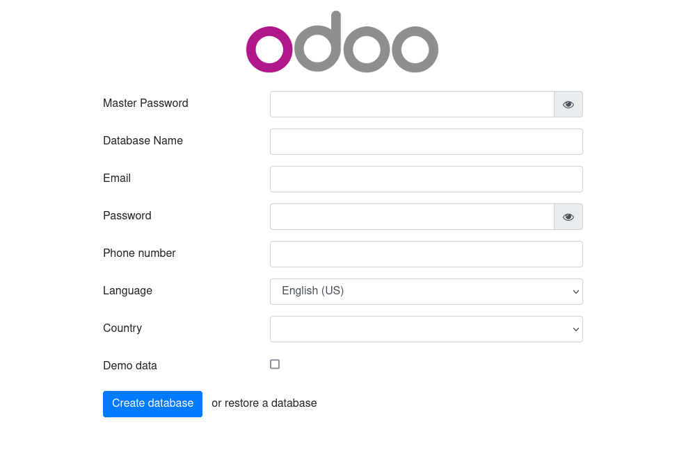
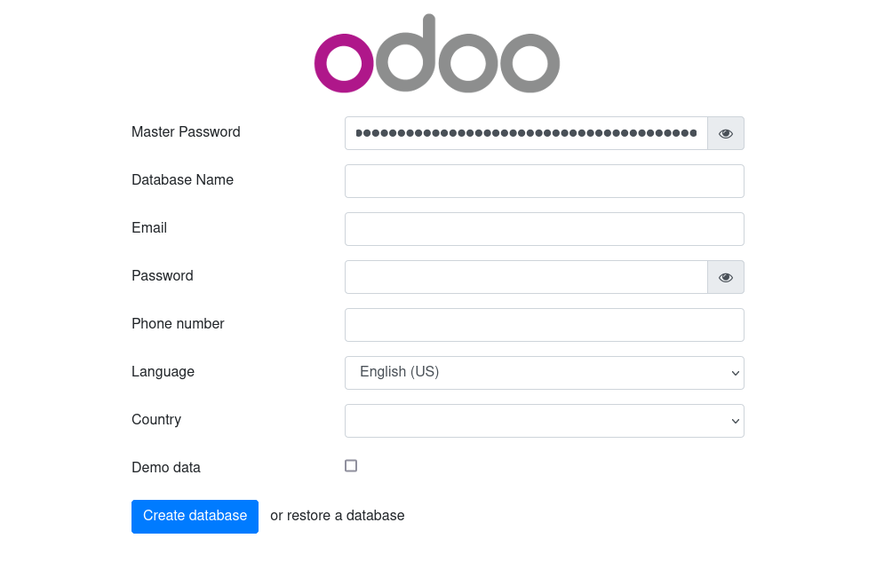

# Instalando Odoo con docker

<p align="center">

<br><br>
<a href="https://gitlab.com/sre_source/docker/odoo-docker-compose/-/releases">
    
</a>
</p>


Una solución flexible, rápida, para impulsar proyectos de [**Odoo**][odoo_web] en producción.

- Versiones soportados de [**Odoo**][odoo] (`13.0`, `13`, `14.0`, `14`, `15.0`, `15`, `latest`).
- Versiones soportados de [**PostgreSQL**][postgres](`10`, `11`, `12`, `13`, `14`, `alpine`, `latest`).

## Caracteristicas

- Para multiples versiones de [**Odoo**][odoo]
- Multiples instancias en un mismo servidor
- Configuraciones de desarrollo y producción optimizadas
- Compatibilidad con Docker mediante [docker-compose][docker_compose] para desarrollo y producción
- Contraseña generada con [OpenSSL][openssl]

## Requerimientos

- [Docker][docker]
- [Docker Compose][docker-compose]
- [Git][git]
- [Curl][curl]

## Uso
Crea un nuevo proyecto de `odoo` ejecutando el siguiente comando; ingrese `Nombre del proyecto`, y
elija la `versión de Odoo`.

```shell
bash <(curl -s https://gitlab.com/sre_resource/docker/odoo-docker-compose/-/raw/main/run.sh)
```

**Advertencia**: después de este punto, cambie 'super_ecommerce'. a su propia información.
Por ejemplo:

```shell
Nombre del proyecto [quickstart]: super_ecommerce
...
Seleccione versión de Odoo:
1) latest
2) 16
3) 16.0
4) 15
5) 15.0
6) 14
7) 14.0
8) 13
9) 13.0
Seleccione de 1, 2, 3, 4, 5, 6, 7, 8, 9 [1]: 

Configurando...
...
```

_Puede tardar unos minutos, tenga paciencia mientras se implementa_

### Pasos posteriores a la instalación

Al finalizar la instalación podrá visualizar contenido similar, sigue estos pasos para terminar de crear su proyecto.

```shell
NOMBRE: super_ecommerce
ESTADO: Implementado
NOTAS:
**Puede tardar unos minutos, tenga paciencia mientras se implementa**

1. Pude acceder a super_ecommerce a travéz de
   http://localhost:8054 o http://host-ip:8054

2. Obtenga la contraseña ejecutando el comando:
   cat super_ecommerce/.env | grep DB_PASSWORD
```

### Acceda a su nuevo proyecto.


En el siguiente formulario deberá ingresar `Master Password`, para obtener la contraseña deberá ejecutar el siguiente
comando (_Ejucanto el paso "2" después de la instalación del proyecto_):

```shell
cat super_ecommerce/.env | grep DB_PASSWORD
```

Copie el valor de `DB_PASSWORD` e ingrese en su formulario de `Odoo`.

```shell
DB_PASSWORD=4D0Uv1G9wm08rXoboTAqHlkqK/Ui79QHCincSr9SY3I=
```




**Paso Opcional:** Entre en el proyecto, (_Recuerde remplazar el nombre del proyecto_) y puede listar el contenido.

```shell
cd super_ecommerce
ls 
```

## Comandos de docker

Es posible que necesite iniciar, reiniciar o detener el proyecto de  **Odoo**, asegurese de estar en el directerio de
trabajo.
Ejecute la instrucción deseada.

**Iniciar**

```shell
docker compose up -d
```

**Reiniciar**

```shell
docker compose restart
```

**Detener**

```shell
docker compose down
```

## Cómo extender esta guía

Esta guía está inspirada para sistema operativo GNU/Linux.
Sin tratar de apoyar a cada posible caso de uso, aquí son sólo algunas que hemos encontrado útiles.

### Entorno de desarrollo

1. `Permisos`: Odoo necesita permisos de lectura y escritura para poder crear un módulo, acceda a su proyecto y ejecute
   este comando.
    ```shell
    chmod 777 odoo/addons
    ```
2. `Addon`: Crea un nuevo módulo ejecutando el comando que se muestra a continuación.
    ```bash
    docker exec -d odoo-$PROJECT_NAME /usr/bin/odoo scaffold $ADDON /mnt/extra-addons
    ```
   Remplace los argumentos:
    - `$PROJECT_NAME`: Nombre del proyecto que declaró al momento de iniciar una instancia de odoo.
    - `$ADDON`: Nombre que recibirá el nuevo módulo.

   El finalizar la ejecución del comando, se creará una estructra similar a ésta.
    ```bash
    ├── controllers
    │   ├── controllers.py
    │   └── __init__.py
    ├── demo
    │   └── demo.xml
    ├── __init__.py
    ├── __manifest__.py
    ├── models
    │   ├── __init__.py
    │   └── models.py
    ├── security
    │   └── ir.model.access.csv
    └── views
        ├── templates.xml
        └── views.xml
    ```

3. `$USER`: Cambia el propietario de addon recién creado, sino cambia el propietario no podrá editar el código fuente
   fuera del contenedor.
    ```bash
    sudo chown -R $USER:$USER odoo/addons/$ADDON
    ```
   Remplace el argumento `$ADDON`, por el nombre del módulo recien creado.


4. `Restart`: Para que el nuevo módulo se pueda instalar desde el panel de administración del proycto `Odoo` debe de
   reiniciar el servicio.
    ```bash
    docker-compose restart
    ```

## Variables de entorno

Ajustar estas variables de entorno para conectar fácilmente a un gestor de base de datos **PostgreSQL** con su
proyecto [`Odoo`][odoo]. Las variable de entorno están alojados en el archivo `.env`

### Odoo

- `PROJECT`: Esta opcional variable de entorno se utiliza para definir un nombre diferente para los proyectos
  de `Odoo`. No debe estar vacío.

- `ODOO_VERSION`: Esta variables de entorno es necesaria para utilizar [`Odoo`][odoo]. No debe estar vacio. En esta
  variable de entorno se establece la version soportado y mantenida por [**Odoo**][odoo].

- `PORT`: Esta opcional variable de entorno es necesaria para utilizar [`Odoo`][odoo]. No debe estár vacio. Se
  implementa para exponer el puerto que escuchará el contenedor del proyecto **Odoo**.

### Postgres

- `POSTGRES_VERSION`: Esta variables de entorno es necesaria para utilizar PostgreSQL. No debe estar vacio. En esta
  variable de entorno se establece la version soportado y mantenida por [Postgres][postgres].([Consulte aquí][postgres])
  , Por defecto utiliza la version `alpine`.

- `POSTGRES_USER`: Este opcional variable de entorno se utiliza en conjunción con `POSTGRES_PASSWORD` configurar un
  usuario y su contraseña. Esta variable va a crear el usuario especificado con permisos de superusuario y una base de
  datos con el mismo nombre. Si no se especifica, el valor predeterminado de usuario de `postgres` va a ser utilizado.

- `POSTGRES_DB`: Este opcional variable de entorno se pueden utilizar para definir un nombre diferente para la base de
  datos por defecto que se crea cuando la imagen se inicia por primera vez. Si no es especificado, entonces el valor
  de `POSTGRES_USER` va a ser utilizado.

- `POSTGRES_PASSWORD`: Esta variable de entorno es necesaria para utilizar PostgreSQL. No debe estar vacío o indefinido.
  Esta variable de entorno se establece la contraseña de superusuario para PostgreSQL. El valor predeterminado de
  superusuario se define por la `POSTGRES_USER` la variable de entorno.

## Dónde se almacenan los Datos

**Nota importante:** Hay varias maneras de guardar los datos usados por las aplicaciones que se ejecutan en contenedores
docker. Animamos a los usuarios de las a familiarizarse con las [`opciones disponibles`][volumes].


[docker]: https://docs.docker.com/engine/install/ "Docker"

[docker-compose]: https://docs.docker.com/compose/install/ "Docker Compose"

[docker_compose]: https://github.com/docker/compose "Docker Compose"

[openssl]: https://www.openssl.org/ "OpenSSL"

[odoo_web]: https://www.odoo.com/es_ES "Odoo"

[odoo]: https://hub.docker.com/_/odoo/ "Odoo"

[postgres]: https://hub.docker.com/_/postgres/ "Postgres"

[volumes]: https://docs.docker.com/storage/volumes/ "Volumes"

[proxy]: https://nginxproxymanager.com/guide/#project-goal "Nginx Proxy Manager"

[FredyChivalan]: https://gitlab.com/fredy_chivalan/docker-nginx-proxy-manager "Configuración de Nginx"
